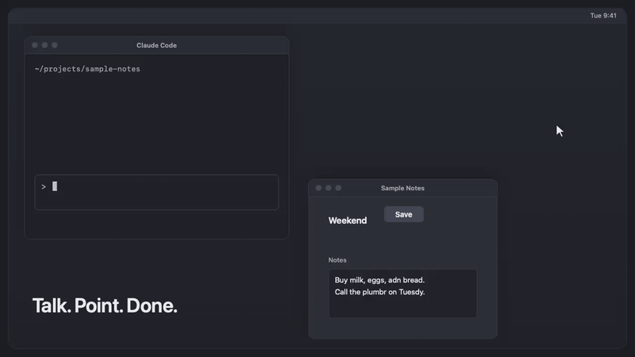

# point-and-speak

Point with the mouse while you talk, and Claude sees what you mean.

Dictate with Claude Code's built-in `/voice` (or type). Say things like *"look at this and change it"*,
*"make that smaller"* or *"fix my circled region"*. Hover over, or circle, something on screen while you speak.
The mod adds hidden context to your prompt: where the pointer was when you said each word, what was under it,
and one small annotated screenshot. Then it deletes the files after the answer.

[Privacy policy](PRIVACY.md) · [Security](SECURITY.md) · [License](LICENSE)

It works over any app, not only the terminal. Keep the terminal focused and only **hover**. A click moves focus.

<p align="center">
  
</p>

## Install

```
/plugin install point-and-speak --marketplace powerpratik/point-and-speak
```

Then follow **Set up** below. This is a young project. The author uses it on one Mac with macOS 26.

## How it works

```
 you speak (built-in /voice)           helper (small, on your Mac)               Claude Code session
 ───────────────────────────           ───────────────────────────               ───────────────────
 hold Space, say "change this"  ───▶   mouse trail, 60 samples a second
                                       "is a microphone in use?" flag  ──▶ start and stop time of your speech
                                       while you speak: 2 frames a second, keep only frames where the
                                       screen CHANGED (a static screen is 1 frame); read the element
                                       under the pointer about 3 times a second, and at each pause
 you submit the prompt  ───────────────────────────────────────────────▶  prompt.submit hook asks the helper
                                       words get times, spread evenly over the speech window
                                       "this/that/here" → the pointer spot at that moment
                                       "circled/highlighted" → a loop drawn with the mouse
                                       writes: overview.png (trail + numbered points),
                                               a crop only where there is no element text
                                                     ──────────────────────▶  context added to your prompt
 the answer finishes  ◀───────────────────────────────────────────────────  the files are deleted
```

What reaches the model, for example:

```
Spoken text with pointer markers: "change this[@1] to blue and that[@2] to red"
@1 (dwell) at (812,430): Safari, window "Docs", AXButton "Save"
@2 (point) at (1204,310): no accessibility info; image: .../point2.png
Overview with the mouse trail (red) and numbered markers (blue): .../overview.png
```

The model gets text first. It reads an image only when the text is not enough. A static screen costs one screenshot.
A clear element label costs no image.

## What it needs

- **macOS.** Tested on macOS 26 only.
- **Claude Code with `/voice`** for speech. The mod also works for typed prompts.
- **[`uv`](https://docs.astral.sh/uv/).** It runs the helper. On the first run it downloads five Python packages from PyPI:
  `pillow`, `numpy`, `pyobjc-framework-Quartz`, `pyobjc-framework-ApplicationServices` and `pyobjc-framework-Cocoa`.
  The versions are pinned, a lock file (`helper/pointer_helper.py.lock`) records them, and a date limit stops uv from
  taking anything newer. It also fetches Python 3.12 or 3.13 if the machine has none.
- **Two macOS permissions** for your terminal app (see below). It needs no microphone permission.

It records no audio. It runs no speech-to-text and no text-to-speech. The helper reads one value from CoreAudio:
whether any input device is in use. Claude Code's `/voice` does the listening and the transcription.

## Set up

1. **Permissions.** Open System Settings, Privacy & Security. Turn on your terminal app (the app that runs Claude Code) in:
   - **Screen Recording**, for the screenshot
   - **Accessibility**, to read the element under the pointer

   Quit and reopen the terminal app after you grant Screen Recording. Accessibility takes effect without a restart.
2. **Check.** Run `uv run --script helper/pointer_helper.py --selftest` in this folder. Both permissions should say `granted`.
3. **Turn on.** In a session, run `/look on`. `/look status` names anything that is missing. `/look off` stops the helper
   from sampling, makes it drop what it holds, and deletes the folders of the current project.

The helper does nothing until `/look on`. It samples no mouse and takes no screenshot while the mod is off.

Without the two permissions the mod still works in a reduced way. It adds the spoken text with markers and the pointer
positions, but no screenshot and no element text.

## Use

Turn on `/voice` (tap mode is easiest), hover over what you mean, and say *"what is this"*. A prompt typed while you hover
works too: the mod uses the last 6 seconds of the mouse trail.

By default the context is added only to prompts that contain a pointing word: this, that, these, those, here, there,
circled, circle, highlighted, selected, outlined, boxed. Turn that filter off in `/config` (`onlyWithPointingWords`)
to add context to every prompt.

Several pointing words said over one resting spot become one marker, so a long sentence does not make many crops.

Settings (`/config`):

| Setting | Default | Meaning |
| --- | --- | --- |
| `onlyWithPointingWords` | on | Add context only to prompts that contain a pointing word |
| `screenshots` | on | Add the screenshot and crops. Turn off to send only the text, the positions and the control names |
| `uvPath` | `uv` | Path to `uv` if it is not on the PATH |

## Privacy

**What is sent to the model.** The text of what you said, the pointer positions, and the names of the app, the window and the
control under the pointer. It also sends the label of the control, up to 160 characters of its text, and the page address
(scheme, host and path only, never a query or fragment). If Claude reads an image, the screenshot goes to the model too.

**The screenshot is of the whole display.** It is downscaled to 1280 pixels wide, with your mouse trail drawn on it. It can
show anything that is on that display: notifications, a password manager, chat windows. The mod does not remove secrets from
it. Hover away from anything you do not want in a prompt, or set `screenshots` to off.

**Password and secret fields.** The mod skips the text of a field when the field is a secure text field, or when its label
mentions a password, passcode, token, API key, card number, CVV or similar words. A web or Electron field that exposes
neither a secure role nor such a label can still be read. Treat this as a help, not a guarantee.

**Text from the screen is untrusted.** A web page or a document can hold text that tries to give the model orders. The mod
flattens the quoted screen text to one line, drops invisible and control characters, caps its length, and tells the model that
it is data and not an instruction. That helps, but it does not make a hostile page safe. Treat hovering over an untrusted page
as asking Claude to read it.

**What is stored.**
- The files live in `<project>/.claude/lookat/<id>/` until the answer ends. They are `overview.png`, `point<N>.png` crops,
  `screen_change<N>.png` frames, and `context.json` (positions, marker kinds and loop boxes, but not your prompt text).
  A `.gitignore` inside `lookat/` keeps them out of git.
- Claude Code saves each image that Claude reads in the session transcript. Deleting the folder does **not** remove
  those copies. If that matters to you, keep the filter on, so images are made only for pointing prompts, or turn `screenshots` off.
- Nothing else is written. The helper keeps frames in memory, at most 6 recordings, and drops them on `/look off`. It deletes
  the temporary file that `screencapture` uses.

**When the files are deleted.**
- When a turn ends with an answer, the folders of the prompt that turn answered are deleted. A prompt you send while a turn
  runs keeps its folder until its own turn ends.
- After an interrupted turn, the folder stays for a retry, then goes with the next sweep.
- Folders older than 15 minutes are swept after each answer. Folders older than 1 hour are swept when `/look on` runs and
  when a session starts with the mod on. `/look off` deletes the folders of the current project while the helper runs.
  Folders in a project that you never open again with the mod on stay until you delete them.

## Security of the helper

The helper is a small web server on `127.0.0.1` with a random port. Any program on your Mac, and any web page in your
browser, can send a request to a local port. So the helper protects itself:

- It makes a random secret each time it starts, and gives it only to the mod. Every request must send that secret.
- It refuses a request whose `Host` header is not `127.0.0.1:<port>`, which blocks DNS rebinding.
- The mod names the one `.claude/lookat` folder that the helper may use. The helper refuses every other folder, even one
  that looks right, and refuses any file action before the mod has named one. It accepts only plain folder names,
  and it refuses symlinks.
- It refuses a request body over 64 KB, a negative length, and a client that stalls for more than 10 seconds.
- It exits on its own if Claude Code goes away.

`helper/check_server.py` tests these rules against the real helper.

## What the mod runs and contacts

**Programs it runs.** The mod and the helper run no shell, no model, no agent and no MCP tool. They run only these:

| Program | Run by | Why |
| --- | --- | --- |
| `uv run --script helper/pointer_helper.py` | the mod, once per session | Starts the helper. `uv` installs the pinned packages. The mod looks for `uv` at the `uvPath` setting, then `~/.local/bin/uv`, then `/opt/homebrew/bin/uv` |
| `screencapture -x -t png -R<x>,<y>,<w>,<h> <temporary file>` | the helper | Takes a screenshot only if the in-process screen grab fails. The temporary file is deleted at once |
| `ps -o ppid= -p <pid>` | the helper, every 5 seconds | Checks that Claude Code is still running, so the helper can exit when it is gone |

The mod reads one environment variable, `HOME`, to find `uv`. It writes none.

**What it contacts.** The mod calls only the helper, at `http://127.0.0.1:<random port>` on your Mac. It sends the text of a
prompt (up to 20 KB), the path of the folder for the files, the on/off and screenshot settings, and the secret token. The helper
answers with text and file paths. Neither the mod nor the helper opens a connection to any other host. The one outside
traffic is from `uv`, not from this plugin: on the first run it downloads the five pinned packages from PyPI
(`pypi.org`, `files.pythonhosted.org`), and it downloads Python itself if the machine has no Python 3.12 or 3.13.

**What each hook does with the calls it sees.**

| Hook | What it does |
| --- | --- |
| `session.start` | Registers the `/look` command. If the mod was on last time, it starts the helper, switches it on, and sweeps old folders |
| `command.run` for `/look` | Handles `/look on`, `/look off` and `/look status`. It sees no other command |
| `prompt.submit` | Sees every prompt. It passes a prompt on unchanged unless the mod is on, the person typed or dictated it, and it contains a pointing word (or the filter is off). Then it sends the text to the helper and adds the text that comes back as extra context. It never edits your words and never blocks a prompt. If anything fails, the prompt goes on as it was |
| `turn.complete` | After the main session answers, it deletes the folders of the prompt that was answered, and sweeps old ones. It sees answers from subagents and ignores them. It returns the result unchanged |

## Limits

- The built-in dictation gives no word times, so each word gets an even share of the speech window. The mod snaps a
  pointing word to the resting spot nearest to it. This is accurate for one or two pointed things, and less so for many quick ones.
- A call app (Teams, Zoom) turns on the same microphone flag. The mod uses a window only when a prompt follows it closely.
- The mod handles the display under the pointer. Tested with one display and with dictated prompts. Typed prompts and
  several displays are not yet tested live.
- Hover only. A click moves focus away from the terminal.
- macOS only.

## Files

- `hooks/register.ts`: the mod (the `/look` command, the `prompt.submit` hook, the cleanup)
- `helper/pointer_helper.py`: mouse, microphone flag, screen, accessibility, and the local server
- `helper/lookcore.py`: pauses, loops, and matching words to pointer positions (pure, tested)
- `helper/lookimg.py`: frame-change check, trail drawing, crops (tested)
- `helper/lookbundle.py`: builds the folder and the text, path checks, cleanup (tested)
- `helper/check_server.py`: live check of the helper's security rules (20 checks)
- `helper/pointer_helper.py.lock`: the locked dependency versions
- `SECURITY.md`: the threat model and how to report a problem

## Checks

```
claude plugin validate .
claude plugin test .
cd helper && uv run --with numpy --with pillow python -m unittest
cd helper && python3 check_server.py        # macOS, starts the real helper
```
